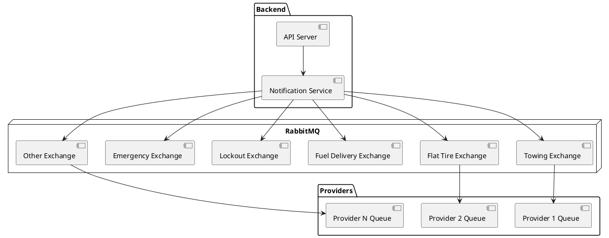

# Notification System Architecture Diagram (PlantUML)

```plantuml
@startuml
package "Backend" {
  [API Server]
  [Notification Service]
}
node "RabbitMQ" {
  [Towing Exchange]
  [Flat Tire Exchange]
  [Fuel Delivery Exchange]
  [Lockout Exchange]
  [Emergency Exchange]
  [Other Exchange]
}
package "Providers" {
  [Provider 1 Queue]
  [Provider 2 Queue]
  [Provider N Queue]
}
[API Server] --> [Notification Service]
[Notification Service] --> [Towing Exchange]
[Notification Service] --> [Flat Tire Exchange]
[Notification Service] --> [Fuel Delivery Exchange]
[Notification Service] --> [Lockout Exchange]
[Notification Service] --> [Emergency Exchange]
[Notification Service] --> [Other Exchange]
[Towing Exchange] --> [Provider 1 Queue]
[Flat Tire Exchange] --> [Provider 2 Queue]
[Other Exchange] --> [Provider N Queue]
@enduml
```

**Description:**
- Illustrates backend, RabbitMQ exchanges, and provider queues.
- Each provider queue is bound to one or more exchanges.
