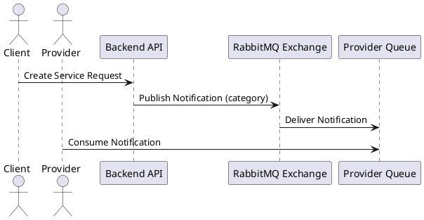

# Notification System Sequence Diagram (PlantUML)

**Description:**
- Shows the flow from service creation to provider notification delivery.
- Providers must have their queue bound to the exchange to receive notifications.
