# Roadside Assistance System - Use Case Diagram

## Overview
This document presents the use case diagram for the Roadside Assistance Backend System, illustrating the interactions between different actors and the system functionalities.

## Actors

### Primary Actors
- **Client**: End users who need roadside assistance services
- **Provider**: Service providers who offer roadside assistance
- **Admin**: System administrators who manage the platform

### Secondary Actors
- **Email System**: External email service for notifications
- **Google OAuth**: External authentication service
- **Database**: Data persistence layer

## Use Cases

### Client Use Cases

#### Authentication & Profile Management
- **UC001: Register Account**
  - Description: Client creates a new account with email, password, and personal information
  - Precondition: Client has valid email address
  - Postcondition: Account created and client logged in

- **UC002: Login with Credentials**
  - Description: Client authenticates using email and password
  - Precondition: Client has existing account
  - Postcondition: Client authenticated and session created

- **UC003: Login with Google OAuth**
  - Description: Client authenticates using Google account
  - Precondition: Client has Google account
  - Postcondition: Client authenticated or account created if new user

- **UC004: Update Profile**
  - Description: Client modifies personal information (name, phone, photo)
  - Precondition: Client is authenticated
  - Postcondition: Profile information updated

- **UC005: Reset Password**
  - Description: Client resets forgotten password via email verification
  - Precondition: Client has registered email
  - Postcondition: New password set and can login

#### Service Management
- **UC006: Request Service**
  - Description: Client creates a new service request with location, category, and description
  - Precondition: Client is authenticated
  - Postcondition: Service request created and available for providers

- **UC007: View Service Status**
  - Description: Client checks the status of their service requests
  - Precondition: Client is authenticated and has service requests
  - Postcondition: Current service status displayed

- **UC008: Rate Service**
  - Description: Client provides rating and feedback for completed service
  - Precondition: Service is completed
  - Postcondition: Rating and feedback recorded

### Provider Use Cases

#### Authentication & Profile Management
- **UC009: Register as Provider**
  - Description: Provider creates account with service categories and credentials
  - Precondition: Provider has valid credentials and service expertise
  - Postcondition: Provider account created (pending approval)

- **UC010: Login with Credentials**
  - Description: Provider authenticates using email and password
  - Precondition: Provider has existing approved account
  - Postcondition: Provider authenticated and session created

- **UC011: Login with Google OAuth**
  - Description: Provider authenticates using Google account
  - Precondition: Provider has Google account
  - Postcondition: Provider authenticated or account created if new user

- **UC012: Update Provider Profile**
  - Description: Provider modifies profile including service categories and contact info
  - Precondition: Provider is authenticated
  - Postcondition: Provider profile updated

#### Service Operations
- **UC013: View Available Services**
  - Description: Provider browses service requests matching their categories
  - Precondition: Provider is authenticated and approved
  - Postcondition: List of available services displayed

- **UC014: Accept Service Request**
  - Description: Provider accepts a client's service request
  - Precondition: Provider is authenticated, approved, and service is available
  - Postcondition: Service assigned to provider and client notified

- **UC015: Update Service Progress**
  - Description: Provider updates service status (in progress, completed)
  - Precondition: Provider has accepted service
  - Postcondition: Service status updated and client notified

- **UC016: Complete Service**
  - Description: Provider marks service as completed
  - Precondition: Provider is working on service
  - Postcondition: Service completed and available for client rating

### Admin Use Cases

#### User Management
- **UC017: Admin Login**
  - Description: Admin authenticates to access administrative functions
  - Precondition: Admin has valid credentials
  - Postcondition: Admin authenticated with elevated privileges

- **UC018: Approve Provider**
  - Description: Admin reviews and approves new provider registrations
  - Precondition: Provider registration exists and is pending
  - Postcondition: Provider approved and can accept services

- **UC019: Manage Users**
  - Description: Admin views, updates, or deactivates user accounts
  - Precondition: Admin is authenticated
  - Postcondition: User account status modified

- **UC020: View System Dashboard**
  - Description: Admin monitors system metrics and user activity
  - Precondition: Admin is authenticated
  - Postcondition: Dashboard with system statistics displayed

#### Content Management
- **UC021: Manage Service Categories**
  - Description: Admin adds, modifies, or removes service categories
  - Precondition: Admin is authenticated
  - Postcondition: Service categories updated system-wide

- **UC022: View System Logs**
  - Description: Admin reviews system logs for monitoring and debugging
  - Precondition: Admin is authenticated
  - Postcondition: System logs displayed

- **UC023: Generate Reports**
  - Description: Admin generates reports on services, users, and system performance
  - Precondition: Admin is authenticated and data exists
  - Postcondition: Reports generated and displayed

### System Use Cases

#### Email Services
- **UC024: Send Verification Email**
  - Description: System sends email verification codes to users
  - Actor: Email System
  - Triggered by: Account registration, password reset requests

- **UC025: Send Service Notifications**
  - Description: System sends email notifications about service updates
  - Actor: Email System
  - Triggered by: Service status changes

#### Authentication Services
- **UC026: Verify Google Token**
  - Description: System validates Google OAuth tokens for authentication
  - Actor: Google OAuth Service
  - Triggered by: Google login attempts

## Use Case Relationships

### Include Relationships
- All authenticated operations **include** user authentication verification
- Service operations **include** logging for audit trails
- Email notifications **include** template formatting

### Extend Relationships
- Login with Google OAuth **extends** standard login process
- Password reset **extends** login process for forgot password scenarios
- Service rating **extends** service completion process

### Generalization Relationships
- Client Login and Provider Login are specializations of User Authentication
- Different service categories are specializations of Service Request

## Use Case Diagram (PlantUML)

```plantuml
@startuml RoadsideAssistanceUseCases

!define RECTANGLE class

actor Client
actor Provider  
actor Admin
actor "Email System" as Email
actor "Google OAuth" as Google

rectangle "Roadside Assistance System" {
  
  package "Authentication" {
    usecase "Register Account" as UC001
    usecase "Login with Credentials" as UC002  
    usecase "Login with Google OAuth" as UC003
    usecase "Reset Password" as UC005
    usecase "Verify Email" as UC024
  }
  
  package "Client Services" {
    usecase "Update Profile" as UC004
    usecase "Request Service" as UC006
    usecase "View Service Status" as UC007
    usecase "Rate Service" as UC008
  }
  
  package "Provider Services" {
    usecase "Register as Provider" as UC009
    usecase "Update Provider Profile" as UC012
    usecase "View Available Services" as UC013
    usecase "Accept Service Request" as UC014
    usecase "Update Service Progress" as UC015
    usecase "Complete Service" as UC016
  }
  
  package "Admin Services" {
    usecase "Admin Login" as UC017
    usecase "Approve Provider" as UC018
    usecase "Manage Users" as UC019
    usecase "View Dashboard" as UC020
    usecase "Manage Categories" as UC021
    usecase "View Logs" as UC022
    usecase "Generate Reports" as UC023
  }
  
  package "Notifications" {
    usecase "Send Notifications" as UC025
  }
}

' Client relationships
Client --> UC001
Client --> UC002
Client --> UC003
Client --> UC004
Client --> UC005
Client --> UC006
Client --> UC007
Client --> UC008

' Provider relationships  
Provider --> UC009
Provider --> UC002
Provider --> UC003
Provider --> UC012
Provider --> UC013
Provider --> UC014
Provider --> UC015
Provider --> UC016

' Admin relationships
Admin --> UC017
Admin --> UC018
Admin --> UC019
Admin --> UC020
Admin --> UC021
Admin --> UC022
Admin --> UC023

' External system relationships
Email --> UC024
Email --> UC025
Google --> UC003

' Include relationships
UC005 ..> UC024 : <<include>>
UC001 ..> UC024 : <<include>>
UC014 ..> UC025 : <<include>>
UC015 ..> UC025 : <<include>>
UC016 ..> UC025 : <<include>>

' Extend relationships
UC003 ..> UC002 : <<extend>>
UC005 ..> UC002 : <<extend>>
UC008 ..> UC016 : <<extend>>

@enduml
```

## Business Rules

1. **BR001**: Only approved providers can accept service requests
2. **BR002**: Clients can only rate services they have requested
3. **BR003**: Service requests must include valid location and category
4. **BR004**: Providers can only work on one service at a time
5. **BR005**: Email verification is required for password reset
6. **BR006**: Admin approval is required for new provider accounts
7. **BR007**: Deleted accounts cannot login but data is preserved
8. **BR008**: Service categories are predefined and managed by admin

## Notes

- This diagram represents the current functionality as implemented in the codebase
- Future enhancements may include real-time tracking, payment processing, and mobile app integration
- The system supports both traditional authentication and OAuth integration
- All user interactions are logged for security and auditing purposes

